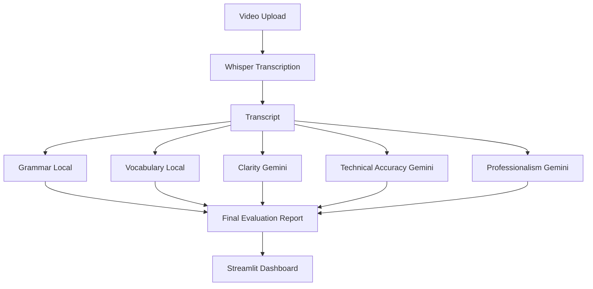

# 🎓 AI Transcript Evaluator

An AI-powered transcript evaluation system that analyzes spoken responses from video recordings using a hybrid architecture combining local NLP techniques and Large Language Models (LLMs).

## 🚀 Key Highlights

- 🎙️ Whisper-based speech-to-text transcription
- ✍️ Grammar evaluation using normalized error density
- 📚 Vocabulary evaluation using MTLD
- 🧠 AI-powered Clarity Assessment
- 🎯 Technical Accuracy Evaluation
- 💼 Professionalism Analysis
- 📊 Interactive Streamlit Dashboard
- ⚡ Hybrid architecture for reduced API usage

---

## 🏗️ Architecture



---

## 💡 Why Hybrid Evaluation?

Objective metrics are evaluated locally:

- Grammar
- Vocabulary

Subjective metrics are evaluated using Gemini:

- Clarity
- Technical Accuracy
- Professionalism

This reduces API usage while maintaining evaluation quality and scalability.

---

## ⚙️ Tech Stack

| Category | Technology |
|-----------|------------|
| Frontend | Streamlit |
| Speech-to-Text | OpenAI Whisper |
| Grammar Evaluation | LanguageTool |
| Vocabulary Evaluation | LexicalRichness (MTLD) |
| AI Evaluation | Google Gemini |
| Visualization | Matplotlib |
| Version Control | Git & GitHub |

---

## 🛠️ Installation

```bash
git clone https://github.com/Ruby-Rubin/AI-Transcript-Evaluator.git

cd AI-Transcript-Evaluator

pip install -r requirements.txt

streamlit run streamlit_app.py
```

Create a `.env` file:

```env
GEMINI_API_KEY=YOUR_API_KEY
```

---

## 📈 Evaluation Metrics

| Metric | Method |
|----------|----------|
| Grammar | Normalized Error Density |
| Vocabulary | MTLD |
| Clarity | Gemini |
| Technical Accuracy | Gemini |
| Professionalism | Gemini |

---

## 🔮 Future Improvements

- Local Open-Source LLM Integration
- PDF Report Generation
- Batch Transcript Evaluation
- Multi-User Support
- Historical Performance Tracking

---

## 👨‍💻 Author

**Rubin Kanna S**

B.Tech Artificial Intelligence and Data Science

Velammal Engineering College
