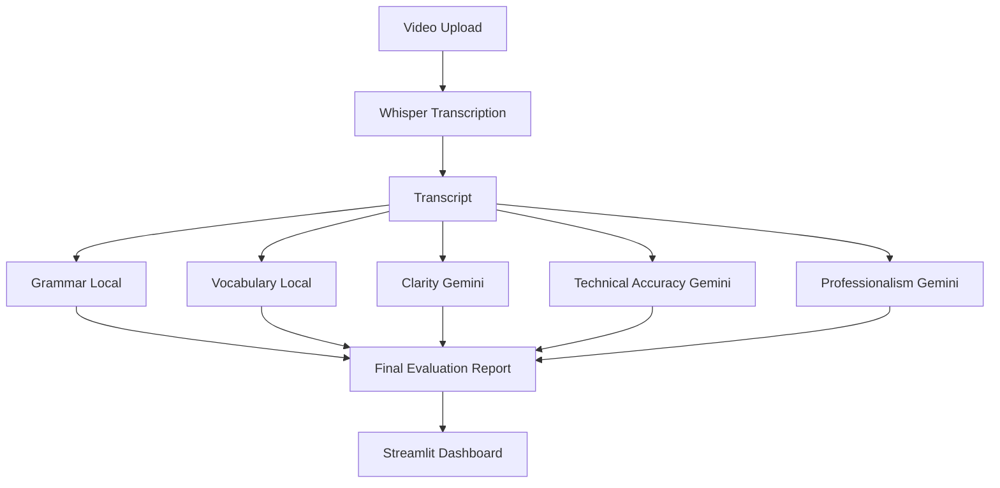

# 🎓 AI Transcript Evaluator

AI Transcript Evaluator is a hybrid AI-powered system that evaluates spoken responses from video recordings. The application uses Whisper for transcription, local NLP techniques for objective metrics, and Gemini for subjective evaluation.

## 🚀 Features

- Video Upload
- Whisper Transcription
- Grammar Evaluation
- Vocabulary Evaluation
- Clarity Assessment
- Technical Accuracy Evaluation
- Professionalism Analysis
- Interactive Dashboard

## 🏗️ Architecture



## ⚙️ Tech Stack

- Streamlit
- Whisper
- Gemini
- LanguageTool
- LexicalRichness
- Matplotlib

## 🛠️ Installation

```bash
git clone https://github.com/Ruby-Rubin/AI-Transcript-Evaluator.git
cd AI-Transcript-Evaluator
pip install -r requirements.txt
streamlit run streamlit_app.py
